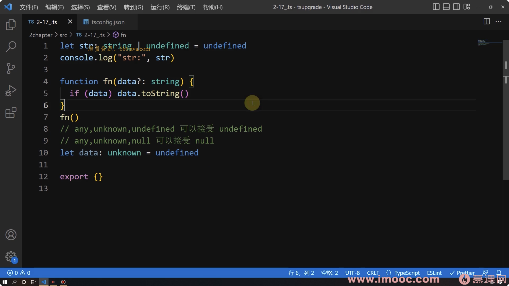
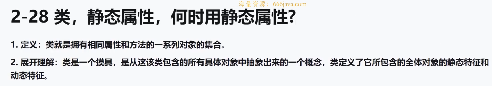

# TS从入门到深度掌握，晋级TypeScript高手

## 第2章深入TS核心语法+各种实战应用（上）
### 2-2 TS的完整定义,环境搭建,6大主要优势

- 完整定义： `融合了后端面向对象思想的超级版的javascript语言`
- 环境搭建：
  > 1. npm init -y
  > 2. npm install typescript -D
  > 3. tsc --init (npx tsc --init)
- 优势：
  > 1. 编译时静态类型检测。
  > 2. 自动提示更清晰明确。
  > 3. 引入了泛型和TS一系列特有的类型。
  > 4. 强大的d.ts声明文件。
  > 5. 轻松编译成JS文件。
  > 6. 灵活性高。

### 2-5 TS编译和编译优化
可以修改tsconfig.json文件中的`rootDir`和`outDir`属性值。执行`tsc(npx tsc)`。

### 2-7 常用的24种TS数据类型
- 基本类型：`number string boolean null undefined symbol`
- 根类型：`Object {}`
- 对象类型：`Array object function`
- 枚举：`enum`
- 其他特殊类型：`any unknown never void tuple(元祖) 可变元祖`
  - `any`: 任意值类型。
  - `unknown`: 表示类型不确定。可以视为严格版的`any`。
  - `never`: 不可能返回任何值。(函数返回的两个场景)
  - `void`: 表示函数没有返回值。
- 合成类型：`联合类型 交叉类型`
- 字面量数据类型：``

### 2-8 never的意义
**`never`**
  > - `never`表示永远不存在的值的类型。
  > - 当一个函数永不返回或总是抛出错误时，它的返回值为`never`类型。
  > - `never`是其他类型的子类型，可以赋值给其他类型。
  
什么场景`never`可以被推导出来而不用被定义出来？
```ts
  type DataFlow = string | number;
  function dataFlowAnalysisWithNever (dataFlow: DataFlow) {
    if (typeof dataFlow === 'string') {
      console.log('字符串类型', dataFlow.length);
    } else if (typeof dataFlow === 'number') {
      console.log('数值类型', dataFlow.toFixed(2));
    } else {
      console.log('没有指定新的联合类型时，这里的dataFlow就是never类型');
    }
  }
```

### 2-9 为什么要用枚举？
解决多次if/switch判断中值的语义化问题。
> - 常量解决的`局限性`：方法参数不能定义为具体类型，只能使用string、number基本数据代替，降低了代码的可读性和可维护性。
> - 枚举的优点：
>   - 有默认值和可自增值，节省编码时间
>   - 语义更清晰，可读性增强
```typescript
const Status = {
  MANAGER_ADUIT_FAIL: -1,
  NO_ADUIT: 0,
  MANAGER_ADUIT_SUCCESS: 1,
  FINAL_AUDIT_SUCCESS: 2
}
// 审核
function getAditStatus(status: number): void {
  if (status === Status.NO_ADUIT) {
    console.log("没有审核");
  } else if (status === Status.MANAGER_ADUIT_SUCCESS) {
    console.log("经理审核通过");
  } else if (status === Status.FINAL_AUDIT_SUCCESS) {
    console.log("财务审核通过");
  }
}
```

### 2-10 枚举的定义、分类、取值方式
- 枚举的定义：`用来存放一组固定的常量的序列`
- 枚举的分类：`字符串枚举、数字枚举`
- 取值方式
  ```js
    // 数字枚举
    enum Week {
      Monday = 1,
      Tuesday,
      Wensday,
      Thirsday,
      Friday,
      Sarturday,
      Sunday
    }

    console.log(Week.Monday); // 1
    console.log(Week['Tuesday']); // 2
    // 数字枚举具有双重映射特点(由key到值，由值到key)
    console.log(Week[3]); // Wensday
    console.log(Week[5]); // Friday

    // 字符串枚举(和普通对象一样，只能由key到值)
    enum WeekEnd {
      Monday = "MyMonday",
      Tuesday = "MyTuesday",
      Wensday = "Wensday",
      Thrisday = "Thrisday",
      Friday = "Friday",
      Sarturday = "Sarturday",
      Sunday = "Sunday",
    }
  ```

### 2-11 解析枚举底层
```js
"use strict";
// 数字枚举
var Week;
(function (Week) {
    Week[Week["Monday"] = 1] = "Monday";
    Week[Week["Tuesday"] = 2] = "Tuesday";
    Week[Week["Wensday"] = 3] = "Wensday";
    Week[Week["Thirsday"] = 4] = "Thirsday";
    Week[Week["Friday"] = 5] = "Friday";
    Week[Week["Sarturday"] = 6] = "Sarturday";
    Week[Week["Sunday"] = 7] = "Sunday";
})(Week || (Week = {}));
console.log(Week.Monday);
console.log(Week["Monday"]);
console.log(Week[3]);
console.log(Week[5]);
// 字符串枚举
var WeekEnd;
(function (WeekEnd) {
    WeekEnd["Monday"] = "Monday";
    WeekEnd["Tuesday"] = "Tuesday";
    WeekEnd["Wensday"] = "Wensday";
    WeekEnd["Thrisday"] = "Thrisday";
    WeekEnd["Friday"] = "Friday";
    WeekEnd["Sarturday"] = "Sarturday";
    WeekEnd["Sunday"] = "Sunday";
})(WeekEnd || (WeekEnd = {}));
```

### 2-13 any、unknown的两点区别和应用场景
- 相同点：`any`和`unknown`可以是任何类型的父类，所以任何类型的变量都可以赋值给`any`类型或`unknown`类型的变量。
- 不同点：
  > - 1. `any`也可以是任何类型的子类，但`unknown`不可以，所以`any`类型的变量都可以赋值给其他类型的变量。
  > - 2. 不能拿`unknown`类型的变量来获取任何属性和方法，但`any`类型的变量可以获取任意名称的属性和任意名称的方法。

**`any`类型比较典型的应用场景**：
- 1. 自定义守卫
  ```ts
    // vue3 源码片段
    // any 的应用场景--自定义守卫中使用any
    export function isRef(r: any): r is Ref {
      return Boolean(r && r.__v_isRef === true); // any类型的 r参数在函数内部获取属性
    }
  ```
- 2. 需要进行`as any`类型断言的场景

**`unknown`一般用作函数参数**：用来接收任意类型的变量实参，但在函数内部只用于再次传递或输出结果，不获取属性的场景。
  ```js
    // vue3源码片段 ref的unknown参数
    function ref(value?: unknown) {
      return createRef(value); // 函数内部只用于再次传递，不获取属性。
    }
  ```

### 2-14 深入理解接口+真实应用场景
1. **接口**: 另一种定义对象类型的类型。
2. **接口应用场景**
   1. 一些第三方包或者框架底层源码中有大量的接口类型。
   2. 提供方法的对象类型的参数时使用。
   3. 为多个同类别的类提供统一的方法和属性声明。
3. **如何定义接口**
4. **接口的继承**
5. **接口与类型别名的异同**:
   1. 相同点：都可以定义类型。
   2. 不同点：
      > 1. `type`可以定义任何类型，包括联合类型、交叉类型、字面量类型、原始类型等；`interface`只能声明对象类型，包括属性、方法、索引等。
      > 2. 当出现使用`type`和`interface`声明同名的类型时，`type`会报错，`interface`会进行合并。
      > 3. `type`通常用于为复杂类型创建别名，方便在代码中使用。`interface`通常用于定义某个实体结构，以及实现该结构的对象或类。
    > 总结：需要定义一个对象类型，或者需要使用继承和实现的特性，就可以使用接口。如果需要定义任意类型的别名，或者需要定义联合类型和交叉类型等复杂类型，就可以使用类型别名。

### 2-16 索引访问类型
索引访问类型形如`T[P]`，有点类似js对象的属性访问。需要注意的是这里的`P`是类型而不是值，否则会报错。
```ts
interface User {
  name: string;
  phone: number;
  address: {
    country: string;
    province: string;
    city: string;
    postalCode: number;
  }
}
```
- 获取用户`address`的类型
  > ``` type Address = User['address']; ```
- 联合类型作为索引访问
   ```typescript
      type NameOrPhone = 'name' | 'phone'; 
      type UserName1 = User[NameOrPhone]; // string | number
   ```
- 深度访问
  > ``` type PostalCode = User['address']['postalCode']; ```
- `T['length']`，数组得到的是`number`类型，元祖得到的是一个数字的字面量类型。
  ```typescript
    type StrArr = string[];
    type TupleArr = [string, number, 'foo'];

    type StrArrType = StrArr['length']; // number
    type TupleArrType = TupleArr['length']; // 3
  ```
- `T[number]`应用在数组和元祖上，获取子项的类型。
  ```typescript
    // 数组
    type Arr = (string | number)[];
    type T1 = Arr[number]; // string | number

    // 元祖
    type Tuple = [string, number];
    type TupleObj = {
      length: 2;
      0: string;
      1: number;
    }
    type T2 = Tuple[number]; // string | number;
    type T3 = TupleObj[0 | 1]; // string | number;
  ```
**总结**:
  - 索引访问类型可以帮我们查找属性的类型；
  - 可以使用联合类型作为索引访问；
  - 可以多层深度访问；
  - 数组和元祖`T['length']`得到的类型不同，这在类型体操中非常有用；
  - `T[number]`可以将数组转为联合类型，结合`typeof`操作符，在一些业务场景下很有用。
  

### 2-17 void
**`void`**：表示没有任何类型。
  > - 没有返回值的函数，其返回值类型为`void`。
  > - 声明变量为`void`，只能将它赋值为`undefined`和`null`。

### 2-18 null和undefined + 相关细节


### 2-19 看似简单的取值为何总抛出错误？
```ts
let obj = {username: "zhangsan", age: 18};
let username = "username";
let u = obj[username]; 
// 报错 ts认为username变量是可变的 可以用const来定义

let obj: object = {username: "zhangsan", age: 18}
const username = "username";
let u = obj[username]; 
// 报错 obj显式定义为object{}类型 ts会认为{}类型上不存在username属性。
```

### 2-20 函数

### 2-24 元祖
**`tuple`元祖**：明确**元素数量**、明确**元素类型**的数组类型。
**满足以下3点就是元祖:**
- 在定义时每个元素的类型都确定
- 元素值的类型必须是当前元素定义的类型
- 元素值的个数必须和定义时个数相同
```ts
  const arr: [string, number, boolean, number] = ["zhangsan", 18, true, 188];
```

### 2-25 TS数组和数组元素怎样同时为只读
**使用`as const`修饰符**，会强制将变量或表达式的类型视为不可变的。

```ts
  const foo = ['a', 'b'] as const;
  foo.push('c'); // 报错，foo类型被声明为不可变的
  // 等价于 const foo: ['a', 'b'] = ['a', 'b'];

  const bar = { x: 1, y: 2 } as const;
  bar.x = 3; // 报错，bar类型被声明为不可变的
  // 等价于 const bar = { x: 1, y: 2 } = { x: 1, y: 2 }

  // 使用const声明的引用类型，不能直接更改其地址。但可以更改里面的元素或属性，使用as const后，属性或元素也不能更改。
```

### 2-26 可变元祖及应用场景
**可变元祖:** 由固定的元祖元素 + `rest`可变部分元素形成新的类型。
**元祖标签:** 只是一个标签作用，无其他作用。
```ts
  const [name, age, address, ...rest]: [name_: string, age_: number, address_: string, ...rest_: any[]] = ["zhangsan", 18, "浙江省杭州市", "18k", "9777777", 666];
```

### 2-28 类 静态属性及其使用场景

